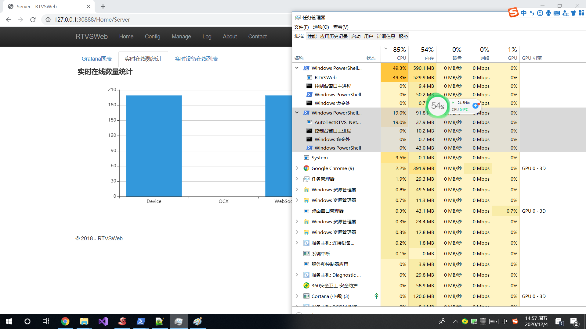

# RTVS
低延迟、跨平台、无插件的商业级1078视频平台

执行标准
> JT/T 1077-2016 道路运输车辆卫星定位系统 视频平台技术要求
> 
> JT/T 1078-2016 道路运输车辆卫星定位系统 视频通讯协议
> 
> JT/T 1078-2014 道路运输车辆卫星定位系统视频通迅协议标准报批稿(仅视频)

支持音频格式
> G711A
> 
> G711U
>  
> G726 40K,32k,24k,16k (支持自动预测)
> 
> ADPCMA
> 
> AMR(仅解码)

## 测试地址


[HTTP地址](http://lib.cvtsp.com/video/CVNetVideoJs/test/tstrtvs.html)


[可对讲HTTPS地址](https://lib.cvtsp.com/video/CVNetVideoJs/test/tstrtvs.html)

默认手机号为一个模拟设备，不一定随时打开着，建议自己挂一台真实设备上去，也方便看延迟。

## 更新

```diff
+ 20200909更新为1.2.0
++ 1.支持H5对讲(需HTTPS或本地文件网页，否则无法获取麦克风);
++ 2.JS控件支持默认按浏览器类型自动选择播放模式，支持不同分屏使用不同播放模式；
++ 3.支持SSL，加载证书后WS和WSS复用同一端口；
++ 4.其他bug修复。

+ 20200828加入测试808网关，支持开箱即用。
```

## 运行方法
RTVS可部署版本已打包成docker镜像并上传到dockerhub，可以通过本项目的启动脚本可快速运行RTVS。

[启动脚本见此文档](script/README.md)


## 808平台接入指南
[前端页面接入文档](JsAccess.md)

[js控件测试页面说明](test/)


[后台接入文档](Platform808Access.md)


## 特色：
1. 无需插件支持，可用于多种浏览器，非FLV或HTTP-FLV方案，不用担心flash支持过期和IOS不支持问题；
2. 绝大部分操作系统(PC、手机)都可以支持；
3. 低延迟模式可达200ms内，且无累积延迟；
4. 硬解支持，CPU占用更低；
5. 前端封装为js控件，集成播放UI与信令接口，接入简单，二次开发也十分方便；
6. 后端为标准接口，方便与其他家808平台对接；
7. 集群、不停机更新支持；
8. C/S控件可用于OCX或C/S客户端，支持直接播放1078 RTP流，1078Http流；
9. 18年已通过1077平台标准符合性检测；
10. 支持H5无插件对讲；
11. 性能优秀，单节点4核8G即可通过交通部压力测试，即至少200路并发视频；
12. 支持服务端缓存，播放/上传过的历史视频无需从设备传输；
13. 完整运维后台支持，每一次视频请求均有记录，通过日志可快速定位问题；
14. 支持多种播放模式(FMP4/Webrtc/RTMP/HLS)，并支持自动根据当前浏览器环境选择最优方案。


## 已测试

> Windows： Chrome Firefox  
> Linux： Chrome Firefox  
> Android： Chrome Firefox 微信网页 QQ网页  
> Mac： Safari Chrome  
> IOS： Safari

## 延迟测试
电脑端开一个计时秒表，用设备的摄像头对着秒表，然后对电脑屏幕截图，将秒表时间与播放画面时间相减就可得到延迟值，从截图来看，基本都在200ms内，且不存在累积延迟。

*注：延迟与设备和网络均有关系，这里的测试环境是设备通过有线连接，服务端为远端IDC机房，其他环境延迟值更低或更高均有可能。* 

> Windows Chrome


> Windows Firefox


> Linux Chrome


## 移动端测试 
> Android Firefox


> Android Chrome


## 前端播放性能测试

> 16路720P实时视频，Windows Chrome，硬解。
> 
> 测试机 I7-5500U 940M 8G 
> 
> Chrome CPU占用约 65% GPU 40% 


## 压力测试

> 测试机 I7-5500U 940M 8G 
> 



QQ交流群：614308923
