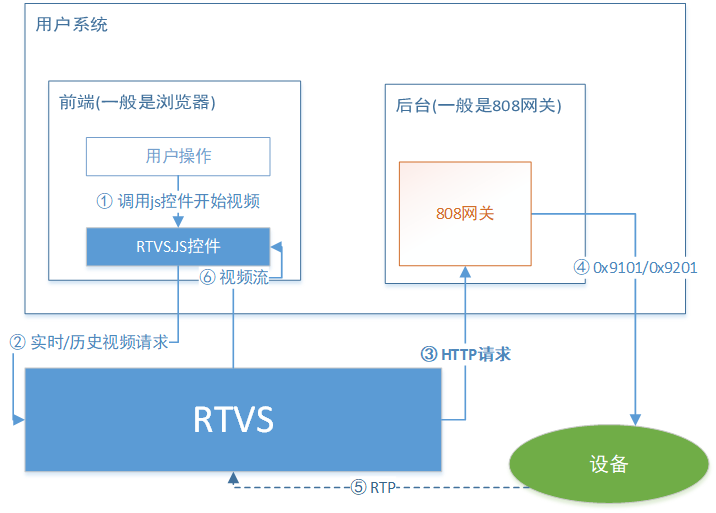
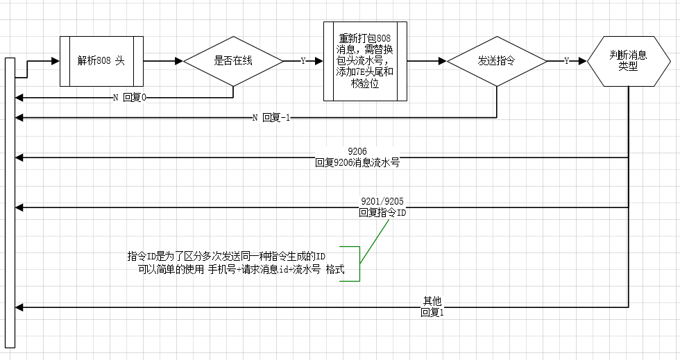
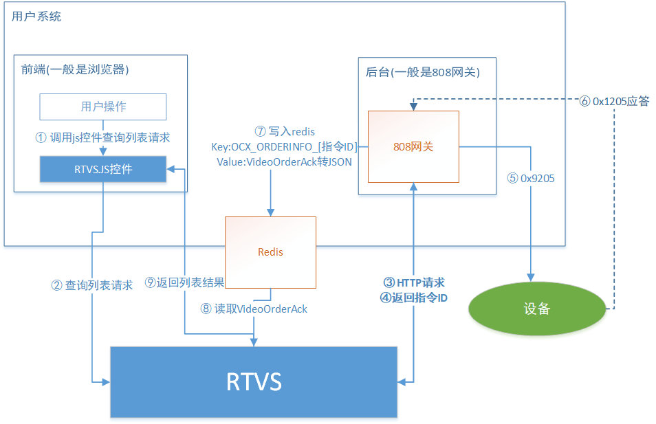
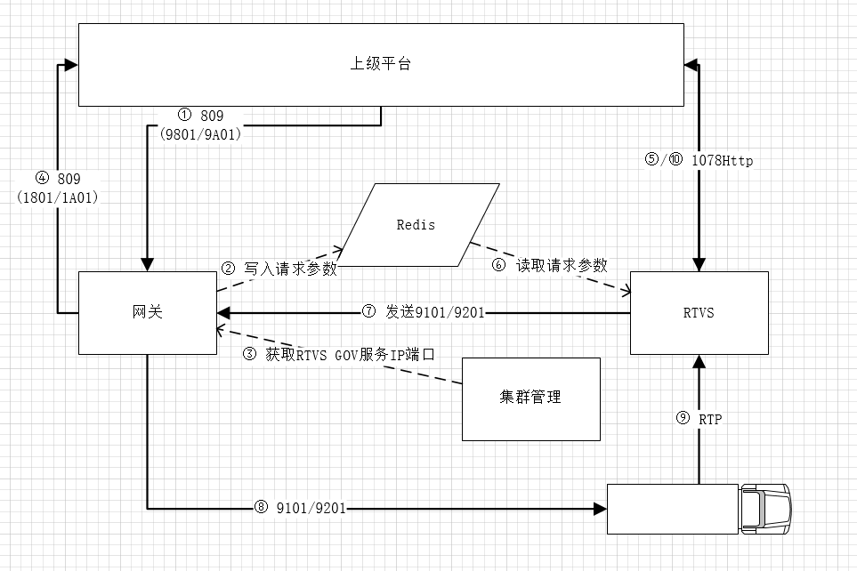
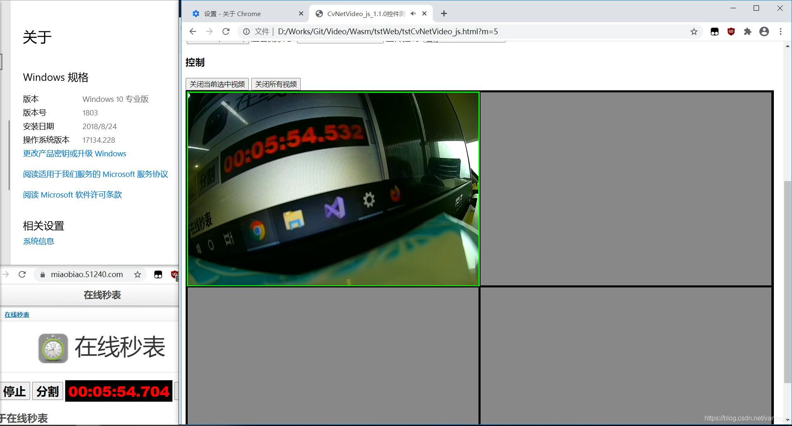
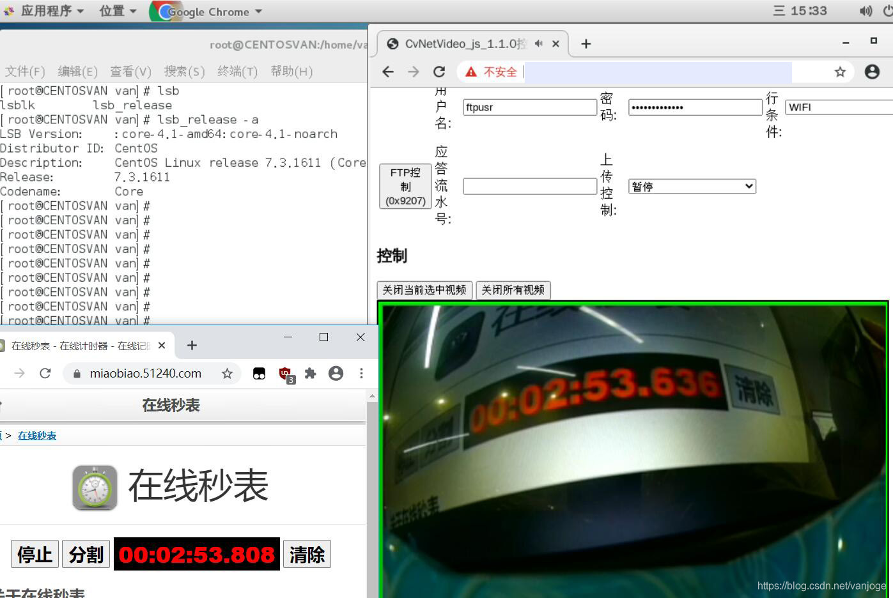
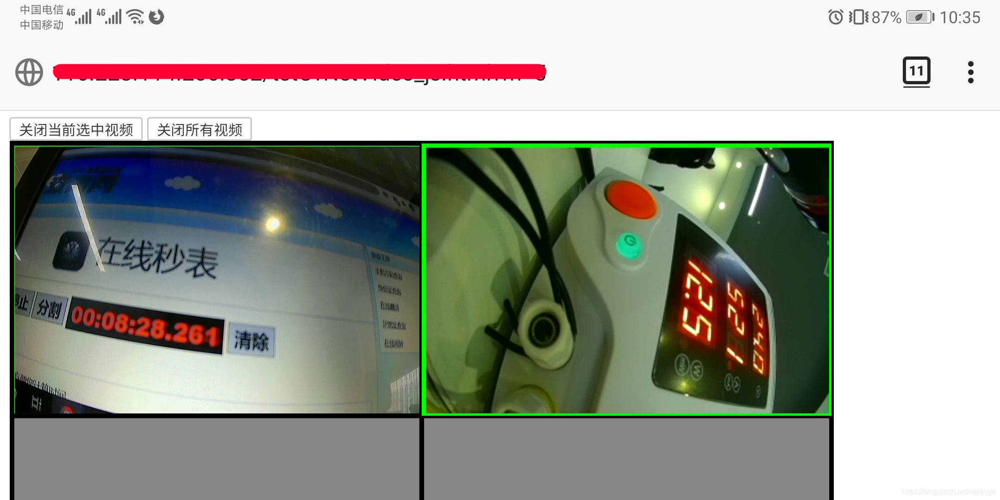
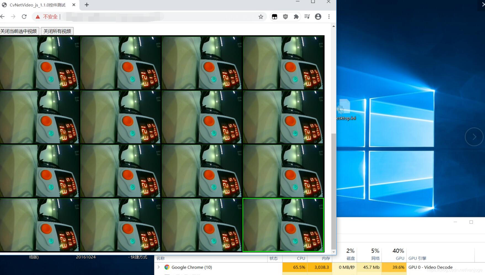

 * [RTVS](#rtvs)
      * [项目及衍生项目地址](#项目及衍生项目地址)
      * [特色：](#特色)
      * [测试地址](#测试地址)
      * [运行方法](#运行方法)
         * [部署](#部署)
         * [模拟器](#模拟器)
      * [808平台接入指南](#808平台接入指南)
         * [前端页面接入](#前端页面接入)
         * [后台接入](#后台接入)
         * [实时/历史视频流程](#实时/历史视频流程)
         * [网关接入处理逻辑](#网关接入处理逻辑)
         * [查询列表流程](#查询列表流程)
         * [GOV请求流程](#gov请求流程)
      * [测试情况](#测试情况)
         * [延迟测试](#延迟测试)
         * [移动端测试](#移动端测试)
         * [前端播放性能测试](#前端播放性能测试)
         * [压力测试](#压力测试)

# RTVS
低延迟、跨平台、无插件、高性能的完整商业级1078/28181视频平台

执行标准
> JT/T 1077-2016 道路运输车辆卫星定位系统 视频平台技术要求
> 
> JT/T 1078-2016 道路运输车辆卫星定位系统 视频通讯协议
> 
> JT/T 1078-2014 道路运输车辆卫星定位系统视频通迅协议标准报批稿(仅视频)
>
> T/GDRTA 002—2020 粤标(20位SIM卡号)
> 
> GB/T 28181-2016 公共安全视频监控联网系统信息传输、交换、控制技术要求
>
> T/JSATL12—2017 道路运输车辆主动安全智能防控系统 （通讯协议规范）
>
> CSAET/CSAE 243.2—2021 道路运输车辆主动安全智能防控系统第2 部分：通讯协议要求
> 
支持音频格式
> G711A
> 
> G711U
>  
> G726 40K,32k,24k,16k (支持自动预测)
> 
> ADPCMA
> 
> AAC
> 
> AMR_NB(仅解码)

## 项目及衍生项目地址


[主动安全附件服务](attachment.md)

RTVS

[https://github.com/vanjoge/RTVS](https://github.com/vanjoge/RTVS)

[https://gitee.com/vanjoge/RTVS](https://gitee.com/vanjoge/RTVS)

JT808GW(808接入网关 实现808协议接入并演示如何实现RTVS所需接口)

[https://github.com/vanjoge/JT808GW](https://github.com/vanjoge/JT808GW)

[https://gitee.com/vanjoge/JT808GW](https://gitee.com/vanjoge/JT808GW)

gbSip(国标28181接入网关 实现SIP信令并对接RTVS接口)

[https://github.com/vanjoge/gbSip](https://github.com/vanjoge/gbSip)

[https://gitee.com/vanjoge/gbSip](https://gitee.com/vanjoge/gbSip)

RTVS微信小程序组件

[https://github.com/vanjoge/RTVS/tree/master/wx](wx)

Android播放端(演示如何实现原生APP播放)

[https://github.com/vanjoge/rtvsAndroidDemo](https://github.com/vanjoge/rtvsAndroidDemo)

[https://gitee.com/vanjoge/rtvsAndroidDemo](https://gitee.com/vanjoge/rtvsAndroidDemo)

JT1078Http2RTP(HTTPGOV流模拟成1078设备连接第三方1078平台)

[https://github.com/vanjoge/JT1078Http2RTP](https://github.com/vanjoge/JT1078Http2RTP)

[https://gitee.com/vanjoge/JT1078Http2RTP](https://gitee.com/vanjoge/JT1078Http2RTP)


## 特色：
1. **全平台**(Windows、Linux、Mac、Android、IOS、微信小程序等)无需插件支持，**支持H5无插件对讲**，可用于多种浏览器，非flex和flv.js方案，无需担心flash支持过期和IOS支持问题；
2. 低延迟模式可达200ms内，且无累积延迟，均为**硬解**，浏览器CPU占用更低；
3. 性能优秀，单节点**4核8G**即可通过交通部压力测试，即至少200路并发视频；
4. 前端封装为js控件，集成播放UI与信令接口，接入简单，二次开发也十分方便，同时集成常用播放器按钮，并支持拖动切换分屏；
5. 支持多种播放模式(FMP4/Webrtc/RTMP/HLS)，并支持自动根据当前浏览器环境选择最优方案；
6. 后端为标准接口，方便与其他家808平台对接，默认带一个808测试网关，可**开箱即用**；
7. 支持服务端缓存，播放/上传过的历史视频无需从设备传输；
8. 集群、不停机更新支持，**可横向扩展支撑超大规模设备接入**；
9. C/S控件可用于OCX或C/S客户端，支持直接播放1078 RTP流，1078Http流，并支持本地录像为MP4等过检必需要求；
10. 18年已通过1077平台标准符合性检测；
11. 完整运维后台支持，每一次视频请求均有记录，运维人员通过日志可快速定位问题，无需开发人员参与；
12. **支持4K**实时/历史视频。

播放拖拽切换 1路4K 1路720P


## 测试地址


[HTTP地址](http://lib.cvtsp.com/video/CVNetVideoJs/test/tstrtvs.html)


[可对讲HTTPS地址](https://lib.cvtsp.com/video/CVNetVideoJs/test/tstrtvs.html)

小程序体验地址


默认手机号为一个模拟设备，不一定随时打开着，建议自己挂一台真实设备上去，也方便看延迟。

## 运行方法

### 部署
RTVS可部署版本已打包成docker镜像并上传到dockerhub，可以通过本项目的启动脚本可快速运行RTVS。

[启动脚本见此文档](script/README.md)

[阿里云部署例子](https://blog.csdn.net/vanjoge/article/details/108319078)

### 模拟器

1078/28181模拟器RTVSDEV

命令行运行下面代码，然后访问http://机器IP:5288即可配置。

``` bash
docker run --restart always -p 5288:80 -d vanjoge/rtvsdevice 
``` 

支持摄像头模拟成1078的 RTVSDEV.APK 请到QQ群内共享下载

## 808平台接入指南

### 前端页面接入
[js(前端页面)接入文档](JsAccess.md)

[js控件测试页面说明](test/)

### 后台接入
[后台(808网关)接入文档](Platform808Access.md)


### 实时/历史视频流程

### 网关接入处理逻辑

### 查询列表流程

### GOV请求流程



## 测试情况

> Windows： Chrome Firefox  
> Linux： Chrome Firefox  
> Android： Chrome Firefox 微信网页 QQ网页  
> Mac： Safari Chrome  
> IOS： Safari

### 延迟测试
电脑端开一个计时秒表，用设备的摄像头对着秒表，然后对电脑屏幕截图，将秒表时间与播放画面时间相减就可得到延迟值，从截图来看，基本都在200ms内，且不存在累积延迟。

*注：延迟与设备和网络均有关系，这里的测试环境是设备通过有线连接，服务端为远端IDC机房，其他环境延迟值更低或更高均有可能。* 

> Windows Chrome


> Windows Firefox


> Linux Chrome


### 移动端测试 
> Android Firefox


> Android Chrome


### 前端播放性能测试

> 16路720P实时视频，Windows Chrome，硬解。
> 
> 测试机 I7-5500U 940M 8G 
> 
> Chrome CPU占用约 65% GPU 40% 


### 压力测试

> 测试机 I7-5500U 940M 8G 
> 200路收发


### GB28181公网对讲
RTVS支持国标<b>公网H5无插件</b>对讲。

测试情况：

|  设备厂家   | 测试情况  |要求|
|  ----  | ----  | ----  |
| Hikvision  | 测试通过  | 需打开每层路由的SIP.ALG|
| TP-LINK  | 测试通过 | 无 |
| DAHUA | 暂无设备测试 | |

QQ交流群：614308923
